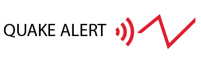

# Quake Alert
 

 

## Quake Alert es una ONG que busca crear un sistema efectivo de medidas de prevención a tomar por la sociedad dependiendo de la gravedad de sismo .

Un sismo es un fenómeno natural que se produce cuando se libera una gran cantidad de energía acumulada en la corteza terrestre, provocando una vibración o movimiento de la misma, esta liberación de energía suele ser de tanta magnitud que ocaciona graves consecuencias, para las estructuras, la infraestructura y lo peor de todo perdidas humanas.

## Problemática

Para entender la problemática primero definimos que es un sismos: es un fenómeno natural que se produce cuando se libera una gran cantidad de energía acumulada en la corteza terrestre, provocando una vibración o movimiento de la misma. Los sismos pueden tener diferentes magnitudes y provocar diversos efectos.

Algunas de las consecuencias más comunes incluyen:

Daños a edificios y estructuras: los sismos pueden causar daños graves a los edificios y otras estructuras, como puentes y carreteras. Estos daños pueden variar desde grietas y daños menores hasta colapsos completos.

Lesiones y pérdidas humanas: los sismos pueden provocar lesiones y pérdidas humanas, ya sea directamente por la sacudida sísmica o como resultado de los daños a las estructuras.

Tsunamis: los sismos submarinos pueden provocar tsunamis, que son olas gigantes que pueden causar daños graves en las zonas costeras.

Interrupción de servicios básicos: los sismos pueden interrumpir los servicios básicos, como el suministro de agua, electricidad y gas. Esto puede afectar gravemente la capacidad de las personas para mantenerse a salvo y recuperarse después del sismo.

Daños económicos: los sismos pueden tener un impacto significativo en la economía, especialmente en las áreas afectadas. Los daños a la infraestructura y los edificios pueden resultar en la pérdida de empleos y la interrupción de la producción y los servicios.
 Lamentablemente aún no se pueden imposibilidad de prevenir los sismos, pero es posible prevenir los sismos, pero si generar conciencia en la sociedad sobre cómo mitigar los peligros asociados a estos eventos.Es para eso que se creó el Proyecto 'QUAKE ALERT' cuyo objetivo principal es crear conciencia sísmica en la población de Chile, dando medidas de Prevención efectivas.

## Objetivo

El objetivo es hacer un analisis de los sismos ocurridos en chile. La interpretación adecuada de los datos permitirá establecer medidas preventivas de manera clara y concisa, de modo que sean fácilmente comprensibles para todos.

El analisis de datos proporciona información clara y concisa sobre los sismos, de esta manera podemos indicar medidas de prevención de los peligros sísmicos. Esto permitirá a la sociedad comprender mejor la naturaleza de los sismos y adoptar medidas adecuadas para minimizar los riesgos y maximizar la seguridad.

Esta información se mostrara através de una interfaz gráfica para que los interesados puedan interactuar y conocer analisis y conclusiones de los Sismos en Chile. 

## Alcance

El alcance del proyecto incluye:

Analisis de datos sísmicos de Chile para comprender la peligrosidad de los sismos intensidad que afectan a la zona, horarios y epocas del año que es mas común que ocurran los siniestros, analisis de epicentros, estudios de mitos.

Visualizaciones interactivas de los datos mediante implementación de funciones de búsqueda y filtrado para permitir a los usuarios explorar datos específicos según sus necesidades e intereses asi poder consultar el comportamiento de los sismos en el tiempo, encontrar patrones comunes y poder generar medidas preventivas adecuadas para cada región de Chile. Actualización periódica de los datos para mantener la información siempre oportuna y reflejar los cambios de la actividad sísmica.

Mediante este analisis y luego de su implementación, se puede crear la conexión con las Entidades de Japón y Estados Unidos para integrar en proyecto Trinacional  “Working towards global standardization of seismological networks and effective communication to the civilian community(Trabajando hacia la estandarización global de las redes sismológicas y la comunicación efectiva a la comunidad civil).

Aca queda información  detallada que sustenta el proyecto: 

1. **`Streamlit`**: Sitio Web donde pueden encontrar tanto la información de los sismos como tambien la información entregada por el modelo de Machine Learning.

2. **`datos`**: Datasets de tres naciones que se monitorean, utilizado para entrenar el algoritmo de aprendizaje automático. En este caso, el conjunto de datos se utilizará para entrenar el sistema de alerta sísmica clasificando el sismo en grado de intencidad y enviar alertas a la población.

3. **`scripts`**: Codigo fuente de la obtención de los datos de los distintos sitios web, normalización de datos y carga automatica para la actualización de los datos.

4. **`etl`**: Transformación y normalización de los datos.

5. **`eda`**: Exploración de los datos.
## Mapa de peligrosidad America: [link](https://d9-wret.s3.us-west-2.amazonaws.com/assets/palladium/production/s3fs-public/atoms/files/SAmer-Proceedings2010_1.pdf)

Esperamos que este repositorio sea una herramienta útil para la ONG **´QUAKE ALERT´**, ya que trabajamos juntos para crear un sistema de alerta sísmica efectivo y seguro para la población.

## Equipo

El equipo del departamento de datos de la **ONG Quake Alert** está formado por:

- [Eduardo Rubén Dominguez](https://github.com/edwardhight52391558) Data Engineer - Machine Learning
- [Sebastian Gomez Estrada](https://github.com/Mezgo?tab=repositories) Data Analyst - Data Engineer
- [Beatriz Rodriguez](https://github.com/Bearodriguez2022) Data Engineer - Data Analyst
- [Gonzalo Carballo](https://github.com/gonzalocba) Functional analysis - Bi

## Skills

Herramientas utilizadas durante este proyecto 

## Diagrama de Gantt
[Link](https://1drv.ms/x/s!AuJ6RRKB6qVXhpZrAZSYngK8NrqbYQ?e=Sba68Z)

## Licencia

Este proyecto fue desarrolado bajo la licenia [GPL V3](https://choosealicense.com/licenses/gpl-3.0/) 

La Licencia Pública General de GNU (GPL) es una licencia de software libre diseñada para garantizar la libertad de los usuarios para utilizar, modificar y distribuir software
